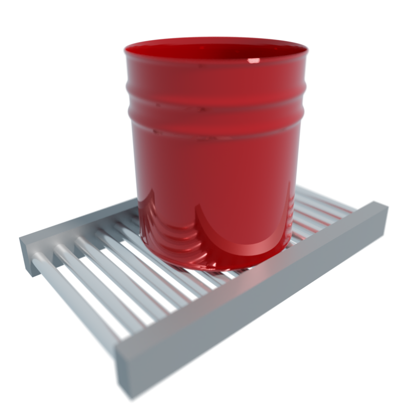
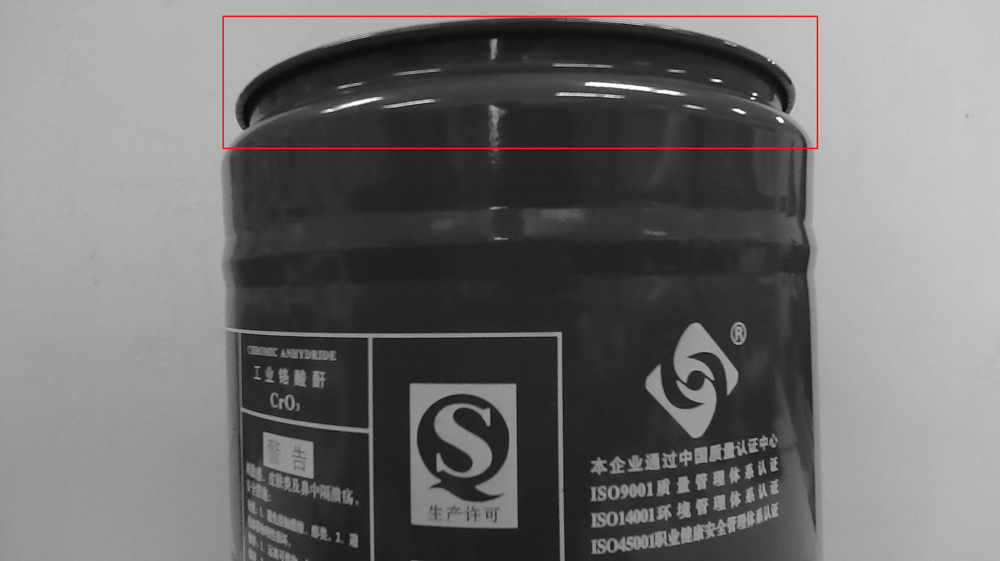
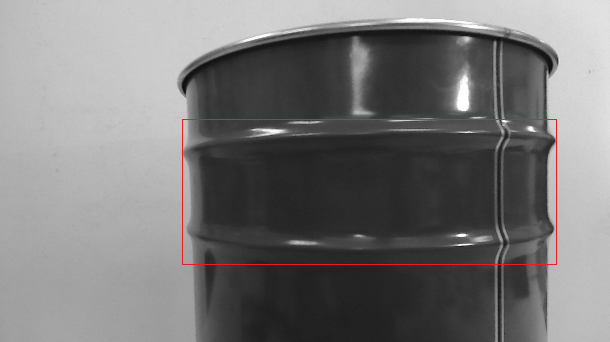

# BucketClassify
<div align="center">

</div>  

用于传送带流水线系统中的桶的分类程序

## Environment

Compute board: Jetson nano B01

System: Linux(Ubuntu 20.04)

OpenCV, cuda, cudnn, these have been configured on the jetson nano system.

## 使用方法
### 自动配置
#### Install

To install,  please open the terminal on this path, type:

```bash
sh install
```

, then press Enter.

#### Run

To run the application, please open the terminal on this path, type:

```bash
sh startWorking
```

, then press Enter.

#### Remove

To remove, simply delete the program folder.

### 手动配置
1. 下载编译darknet
2. 复制该仓库代码至darknet主目录下：
```bash
cp -r code/ darknet/
```
3. 下载权重文件，放至darknet主目录下。
4. 运行主程序
```bash
cd darknet/
python3 bottle.py
```
## Introduction

​	The main function of the software is to sort the barrels on the conveyor belt. The feature of this software is that it uses deep learning algorithms to analyze images, and uses GPIO to control hardware devices to realize automatic classification of buckets.
​	In the implementation process, this software uses the open source deep learning framework Darknet for image analysis. Specifically, this software decomposes the input video stream into a series of frames, uses Darknet for target detection on each frame, and extracts the target information. By analyzing the type and coordinates of the target, **the software can automatically determine the type of bucket, and control the hardware device through GPIO to classify the bucket into the corresponding category.**
​	For edge computing devices like jetson nano, the program uses yolov4-tiny. Compared with yolov4, yolov4-tiny can run on edge computing devices at a higher frame rate under the premise of ensuring the accuracy of target detection, and is suitable for embedded devices or edge computing scenarios. This program uses yolov4-tiny to run more efficiently on jetson nano and still guarantee good classification accuracy.
​	In order to adapt to buckets of different colors, the input image needs to be preprocessed as a grayscale image, and the color information is ignored to avoid the influence of color on target detection. In the target detection stage, the program only pays attention to the protrusions and grooves on the outer ring of the barrel, while ignoring the pattern or text printed on the barrel. This ensures that the barrel sorting system is not affected by printed patterns or text, thereby improving sorting accuracy.
​	The software uses a dynamic threshold algorithm to improve the accuracy of classification. By analyzing the position and size of the target on the image, the height of the classification threshold can be dynamically adjusted to adapt to shooting conditions at different positions and angles, thereby improving the accuracy and stability of bucket classification.

## Detailed configuration

For more custom settings, please check `darknet/bottle.py`, like:

```python
#---------Set configuration file path---------#
config_file = "./cfg/yolov4-tiny.cfg"
data_file = "./cfg/bottle.data"
weights = "bottleV4.weights"
# ---------Set detection parameters--------- #
thresh = 0.85
nms = 0.01
maxObjectNum = 1
CamPath = 0
# ---------Set up visualization--------- #
print_Fps = False
print_Detections = False
show_img = True
# ---------Set up GPIO--------- #
pin_1 = 32
pin_2 = 31
pin_3 = 29
#----------Set up thresh----------#
left_bounce=darknet_width*0.4
right_bounce=darknet_width*0.6
liner_k = 0
left_thresh_height = 330
```

- `config_file`: The path to the YOLOv4 configuration file. This file contains the network architecture and hyperparameters for the object detection model.
- `data_file`: The path to the data file used for training the model. This file contains the paths to the training, validation, and testing datasets, as well as the number of classes in the dataset.
- `weights`: The path to the pre-trained weights for the object detection model. 
- `thresh`: The confidence threshold used for object detection. Any detection with a confidence score below this threshold will be discarded.
- `nms`: The non-maximum suppression threshold used for post-processing of object detection results. This threshold controls the degree of overlap between detected objects that are considered as separate objects.
- `maxObjectNum`: The maximum number of objects supported in the same frame. This setting can be used to limit the number of objects that are processed in a single frame.
- `CamPath`: The path to the camera device. This can be set to 0 for the default camera device, or to the path of a specific camera device.
- `print_Fps`: Whether to print the frame rate on the console. If set to `True`, the frame rate will be displayed in the console output.
- `print_Detections`: Whether to print the object detection results on the console. If set to `True`, the object detection results will be displayed in the console output.
- `show_img`: Whether to display the video detection screen with GUI. If set to `True`, the video detection screen will be displayed with a graphical user interface.
- `pin_1`, `pin_2`, `pin_3`: The GPIO pins corresponding to each class of the bucket. These pins are used to control the outputs based on the detected bucket classes.
- `left_bounce`, `right_bounce`: The left and right sides of the "detection boundary". Bucket that are detected within this boundary will be classified.
- `liner_k`: The slope of the altitude threshold line. This line is used to distinguish objects that are small or big.
- `left_thresh_height`: The height to the left of the altitude threshold line.

## Use custom AI model

We default users to use the models we provide, but if users need to configure their own models for use, please follow the steps below and pay attention to the requirements for data content described below.

### Replace model

Put the user's own model weights into the darknet folder, and then modify the "weights" parameter in `darknet/bottle.py`

The original weights file name is `bottleV4.weights`

### Data content

The type of detection target definition is mainly for the convex shape on the outside of the bucket.

The images used for training should be grayscale images, and the conversion script can be found in the `tools` folder under the software directory.

There are 3 types of objects in total.
`class1`: the first type of convex shape



`class2`: the second type of convex shape



`class3`: The connection piece of the bucket handle


`class3` can be set as any target, but it should be noted that it can only represent a special feature of a bucket, because the detection of class3 is to directly distingtishouuish the smallest bucket. Otherwise, it is necessary to combine the height of class2 to distinguish between large buckets and small buckets.
